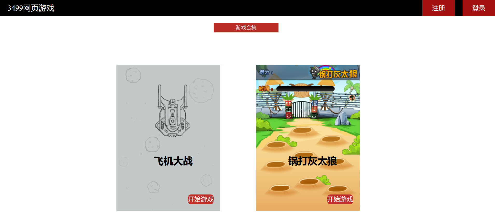
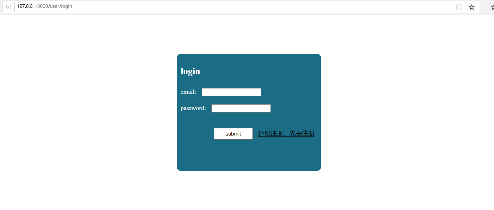
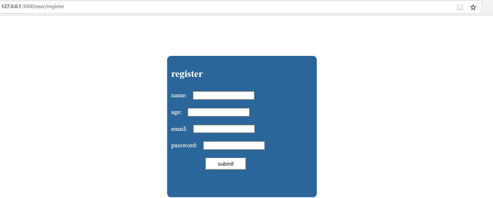
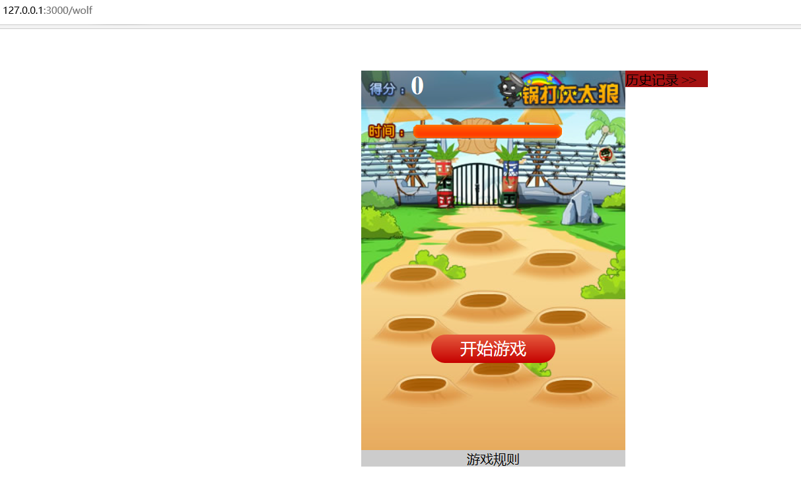
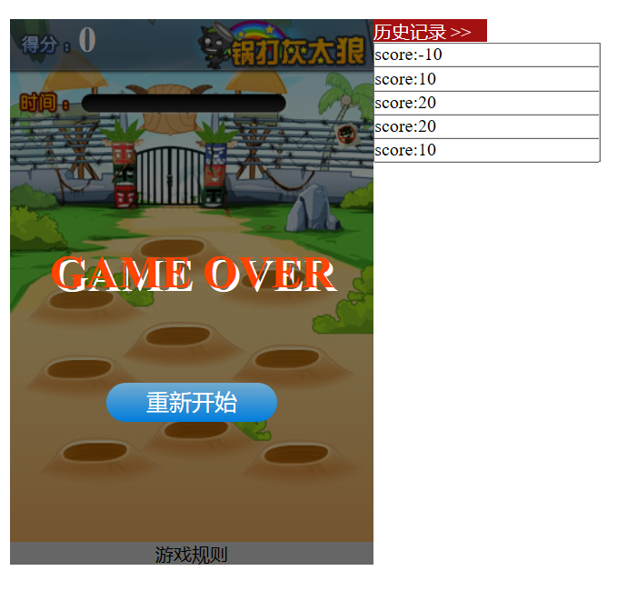

# 小游戏合集

该游戏是基于node.js的一个游戏项目，一共有两个小游戏包括飞机大战和打地鼠游戏

首页： 包含注册，登录功能，因为会把登录的session保存起来，只有在登录状态的时候才能开始游戏

登录界面：当没有该账号时会提示账号或密码错误，点击去注册，跳转到注册页面，登录成功后会记录登录状态

注册界面：输入信息后，会判断是否已经存在该用户，当存在则注册失败，反之注册成功，直接保存登录状态

游戏界面：当登录成功后就可以点击开始游戏，进入游戏界面，因为设置了分数相关的数据库，当账号登录时，会查找该用户分数的历史记录，这里只设置了最近五条历史记录，游戏结束后会将该局分数，传输分数数据库保存起来，当下次重新开始游戏的时候，去数据库查找到前五条数据再显示出来。

